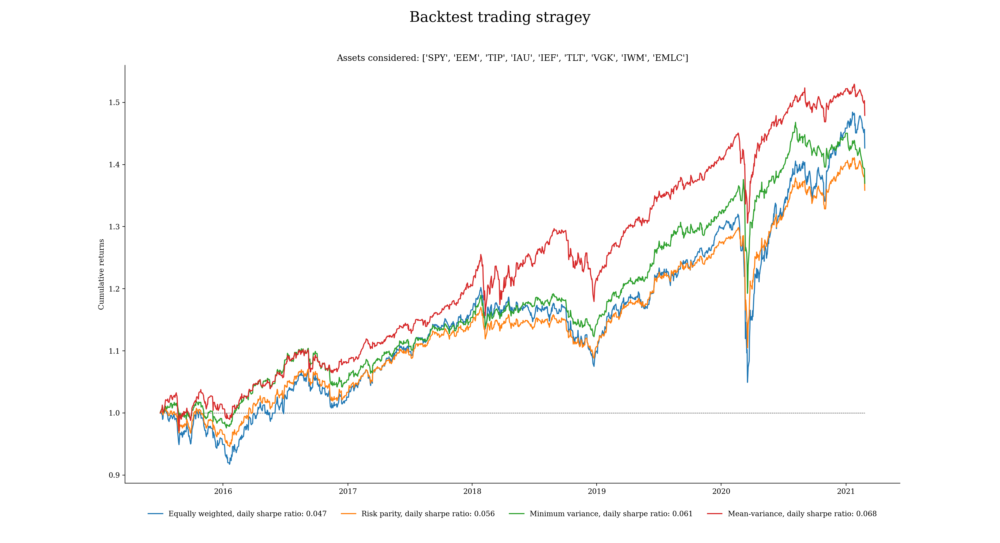

# Backtesting trading strategies

#### Last Update February 25, 2021 ####
#### Matteo Bottacini, [matteo.bottacini@usi.ch](mailto:matteo.bottacini@usi.ch) ####


# Project description

This project is to backtest different trading strategies applying different approaches from the Modern Portfolio Tehory (MPT) in `Python 3`.

The strategies backtested are:
* [The Optimal Markowitz Portfolio](#Mean-variance portfolio);
* [The Global Minimum Variance Portfolio](#Minimum variance portfolio);
* [The Risk-Parity Portfolio](#Risk parity portfolio);
* [The Equally Weighted Portfolio](#Equally weighted portfolio)


The ETFs considered are:
* EEM: iShares MSCI Emerging Markets ETF 
* EMLC: VanEck Vectors J.P. Morgan EM Local Currency Bond ETF
* IAU: iShares Gold Trust
* IEF: iShares 7-10 Year Treasury Bond ETF
* IWM: iShares Russell 2000 ETF
* SPY: SPDR S&P 500 ETF Trust
* TIP: iShares TIPS Bond ETF
* TLT: iShares 20+ Year Treasury Bond ETF
* VGK: Vanguard FTSE Europe Index Fund ETF Shares


The scripts do the following:
* Download and analyse financial data;
* Find the optimal Markowtiz portfolio (mean-variance);
* Find the Global Minimum Variance (GMV) portfolio (minimum variance);
* Find the risk-parity portfolio (risk parity);
* Find the equally weighted portfolio (equally weighted);
* Backtest a trading strategy with monthly rebalance with out-of-the-sample results;
* Compare the results.


Folder structure:
~~~~
trading-strategy-backtest/
    deliverable/
        run_backtest.py
    src/
        equally_weighted_portfolio.py
        mean_variance_portfolio.py
        minimum_variance_portfolio.py
        risk_parity_portoflio.py
    README.md
~~~~


# Trading strategy configuration
Each model is setup in its specific scripts.

### Equally weighted portfolio ###
```python
def equally_weighted_portfolio(ret):
    init_weights = [1 / len(ret.columns)] * len(ret.columns)
    opt_weights = init_weights

    return opt_weights
```

### Risk parity portfolio ###
```python
def risk_parity_portfolio(ret):
    init_guess = 1 / ret.std()
    opt_weights = list(init_guess / init_guess.sum())

    return opt_weights
```

### Minimum variance portfolio ###
```python
import numpy as np
from scipy.optimize import minimize


def minimum_variance_portfolio(ret):

    # define objective function to minimize: variance
    def get_portfolio_variance(weights):
        weights = np.array(weights)  # check
        cov_mat = ret.cov()
        port_variance = np.dot(weights.T, np.dot(cov_mat, weights))
        return port_variance

    # equality constraint: sum of the weights = 1
    def weight_cons(weights):
        return np.sum(weights) - 1

    # model set-up
    # - long only portfolio
    # - initial guess
    # - constraints
    bounds_lim = ((0, 1),) * len(ret.columns)
    init_weights = [1 / len(ret.columns)] * len(ret.columns)
    constraint = {'type': 'eq', 'fun': weight_cons}

    # find optimal portfolio
    opt_port = minimize(fun=get_portfolio_variance,
                        x0=init_weights,
                        bounds=bounds_lim,
                        constraints=constraint,
                        method='SLSQP')

    # find optimal weights
    opt_weights = list(opt_port['x'])

    return opt_weights
```

### Mean-variance portfolio ###
```python
# import modules
import numpy as np
from scipy.optimize import minimize


def mean_variance_portfolio(ret):

    # define objective function to minimize: sharpe ratio
    def get_portfolio_sr(weights):

        weights = np.array(weights)  # check

        # expected returns
        port_ret = np.dot(ret, weights)
        mean_ret = port_ret.mean()

        # volatility
        cov_mat = ret.cov()
        port_std = np.sqrt(np.dot(weights.T, np.dot(cov_mat, weights)))

        # sharpe ratio
        port_sr = mean_ret / port_std
        return port_sr

    def objective_fun(weights):
        neg_sr = get_portfolio_sr(weights) * (-1)
        return neg_sr

    # equality constraint: sum of the weights = 1
    def weight_cons(weights):
        return np.sum(weights) - 1

    # model set-up
    # - long only portfolio
    # - initial guess
    # - constraints
    bounds_lim = ((0, 1),) * len(ret.columns)
    init_weights = [1 / len(ret.columns)] * len(ret.columns)
    constraint = {'type': 'eq', 'fun': weight_cons}

    # find optimal portfolio
    opt_port = minimize(fun=objective_fun,
                        x0=init_weights,
                        bounds=bounds_lim,
                        constraints=constraint,
                        method='SLSQP')

    # find optimal weights
    opt_weights = list(opt_port['x'])

    return opt_weights
```

# Backtest configuration
In the script `../deliverable/run_backtest.py` you can change the main variables to spot your ideal asset allocation and strategy.
The parameters you can change are the following:
* Assets;
* Length of the training set
```python
# feel free to change the following parameters:
tickers = []
months_training_set = 12 * 5
```

# Results


# Supported versions
This configuration has been tested against Python 3.8
